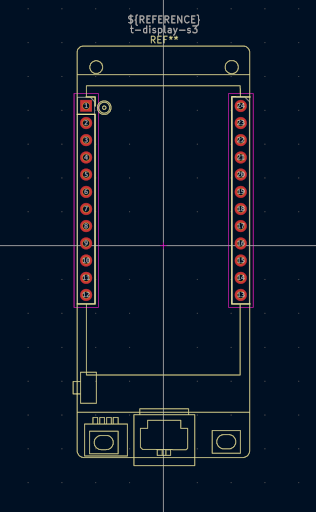

# Kicad Schematic Symbol and Footprint for the T-Display-S3

This repository contains a schematic symbol and footprint for the [LILYGO T-Display-S3](https://lilygo.cc/products/t-display-s3?srsltid=AfmBOoqkTxyjbl_XtiVcY_CcfGRxfTgQOD-fBYJJ8vYBRWv3ooJXRyuM) ESP32 development board. These might be useful to you if you're designing a "shield" or "hat" PCB for the T-Display-S3. This was made in Kicad 9.0.

